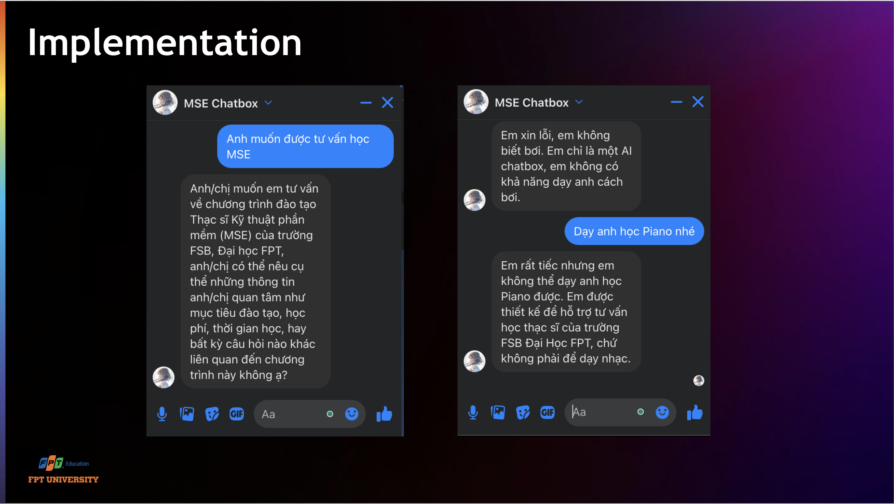

# Chatbot AI for FPT University FSB Master Software Engineering

## Overview


This project is a Chatbot AI designed for FPT University's FSB Master Software Engineering program. It utilizes a Large Language Model (LLM) named Gemini, integrated with Retrieval-Augmented Generation (RAG) techniques to enhance user interaction and provide accurate, context-aware responses. The chatbot is built using the Langchain framework and is served via a Flask web application.

## Main Features

- **Generative AI Chatbot**: Leverages Gemini LLM to understand and generate human-like text responses.
- **RAG Integration**: Enhances responses by retrieving relevant information from external data sources.
- **Meta Messenger Integration**: Allows users to interact with the chatbot through Meta Messenger.

## Technical Stack

- **LLM**: Gemini
- **Framework**: Langchain
- **Library**: Flask
- **Dependencies**:
  - `requests`
  - `langchain-google-genai`
  - `langchain`
  - `langchain-community`
  - `pypdf`
  - `pdf2image`
  - `tiktoken`
  - `unstructured[local-inference]`
  - `sentence_transformers`
  - `chromadb`

## Setup Instructions

### Prerequisites

- Python 3.x
- Meta Messenger Developer Account
- Google API Key
- Vercel KV (Key-Value Store) Account

### Environment Variables

Before running the app, ensure that the following environment variables are set:

```sh
export VERIFY_TOKEN=<your_verify_token>
export PAGE_ACCESS_TOKEN=<your_page_access_token>
export GOOGLE_API_KEY=<your_google_api_key>
export VERCEL_KV_URL=<your_vercel_kv_url>
export VERCEL_KV_TOKEN=<your_vercel_kv_token>
export PORT=<your_port>
export DEBUG=<your_debug_mode>
```

### Installation

Clone the repository:

```sh
git clone https://github.com/your-repo/chatbot-ai-fpt-fsb.git
cd chatbot-ai-fpt-fsb
```

Install dependencies:

```sh
pip install -r requirements.txt
```

### Running the App

Run the following command to start the Flask application:

```sh
python3 index.py
```

### Running the App

Ensure your Flask application is running.
Open Meta Messenger and start a conversation with your chatbot.
Interact with the chatbot to test its response capabilities and contextual accuracy.

### Contribution

We welcome contributions to enhance the functionality and performance of this chatbot. Please fork the repository and submit a pull request with your proposed changes.

### License

This project is licensed under the MIT License. See the LICENSE file for more details.

### Contact

For any queries or support, please contact the project maintainer at [chaubao.work@gmail.com].
